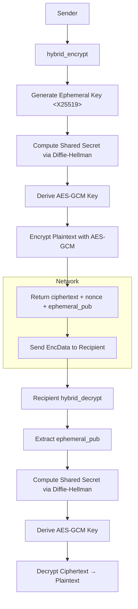

# `crypto_utils.py`

## Overview
This module implements **hybrid encryption** using an ephemeral X25519 key pair for key exchange and AES-GCM for symmetric encryption.  
The design provides **forward secrecy** (each message uses a fresh key) and **message integrity** through authenticated encryption.

---

## Function Reference

### `generate_keypair()`
Generates a permanent X25519 key pair for sender or recipient.

**Returns:**
`(private_key, public_key)` — both are cryptography objects that can be serialized into hex or bytes.

---

### `hybrid_encrypt(recipient_pub_hex, plaintext: bytes)`
Performs hybrid encryption in five steps:

1. Convert recipient’s public key from hex to bytes.  
2. Generate a random ephemeral private key.  
3. Derive a shared secret via Diffie–Hellman key exchange (`ephemeral_sk.exchange(recipient_pub)`).  
4. Use the first 32 bytes of the shared secret as an AES-GCM key.  
5. Encrypt the plaintext with a random 12-byte nonce.

**Returns:**  
A JSON-serializable dictionary:  
```json
{
  "ciphertext": "<base64-encoded ciphertext>",
  "nonce": "<base64-encoded nonce>",
  "ephemeral_pub": "<hex of ephemeral public key>"
}
```

---

### `hybrid_decrypt(recipient_sk, enc_data)`

1. Extract the ephemeral public key from enc_data.
2. Derive the same shared key with the recipient’s private key.
3. Decrypt using AES-GCM and return the original plaintext.

---

## Architecture Diagram


